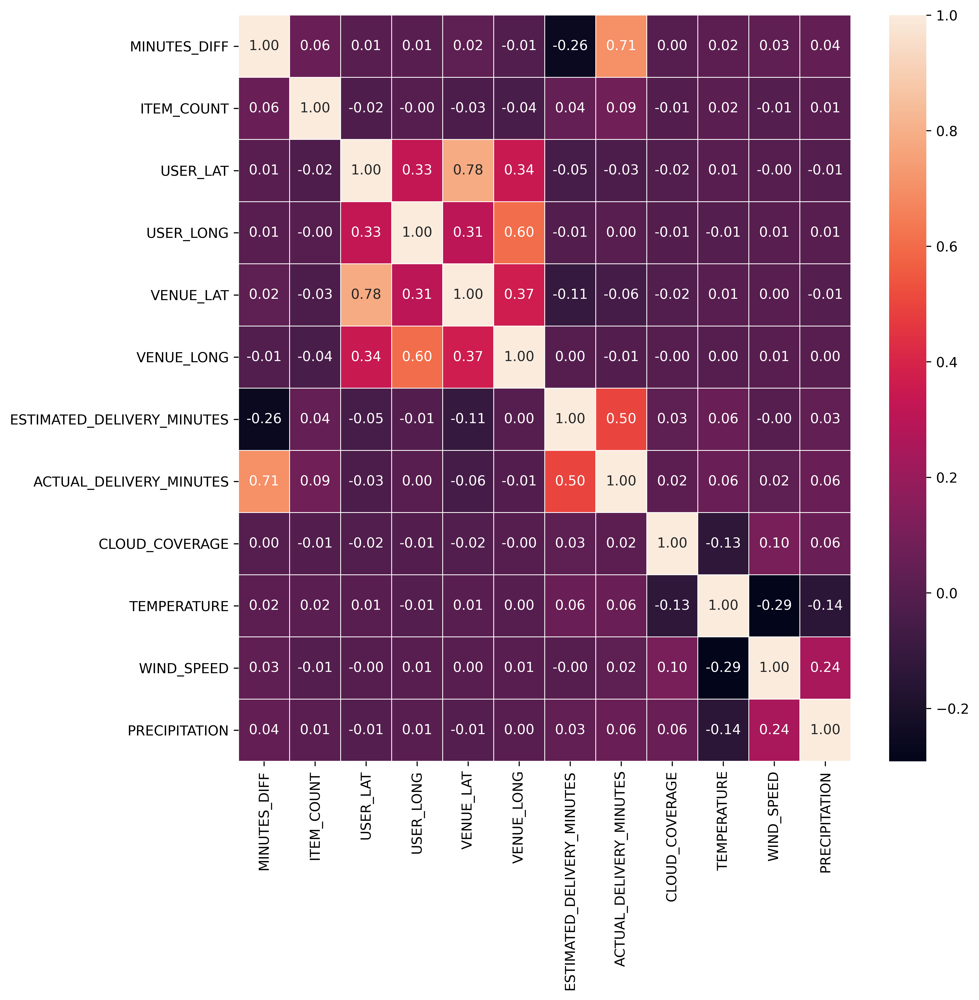
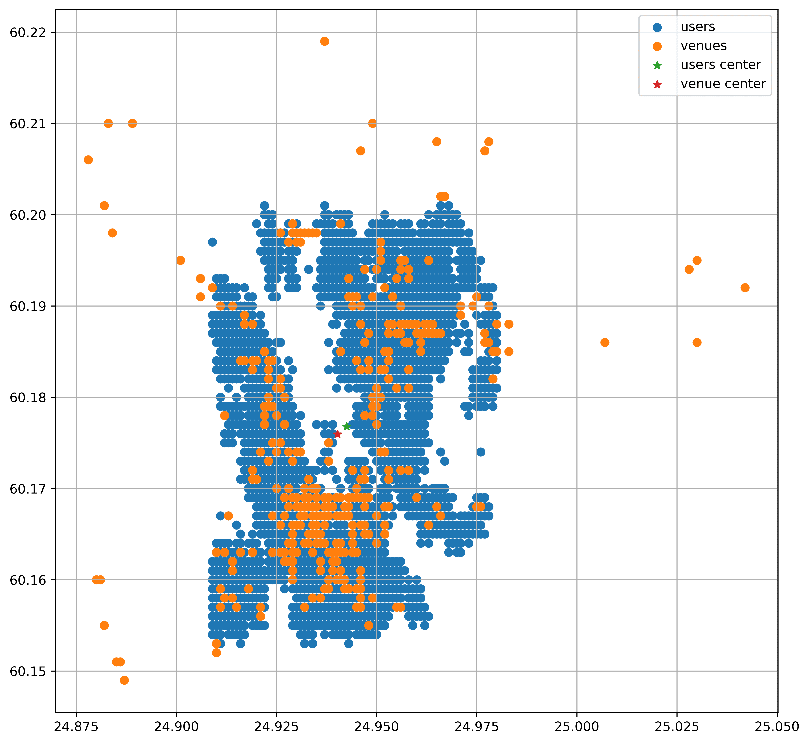
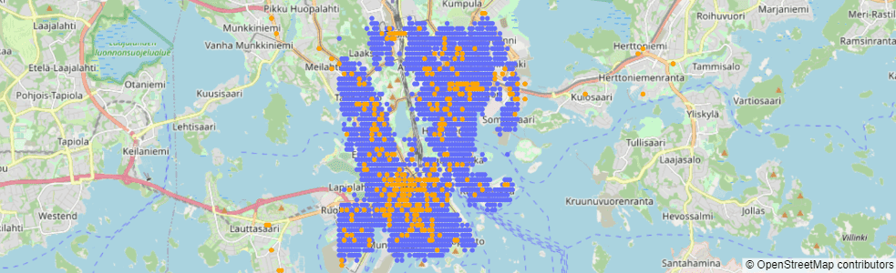
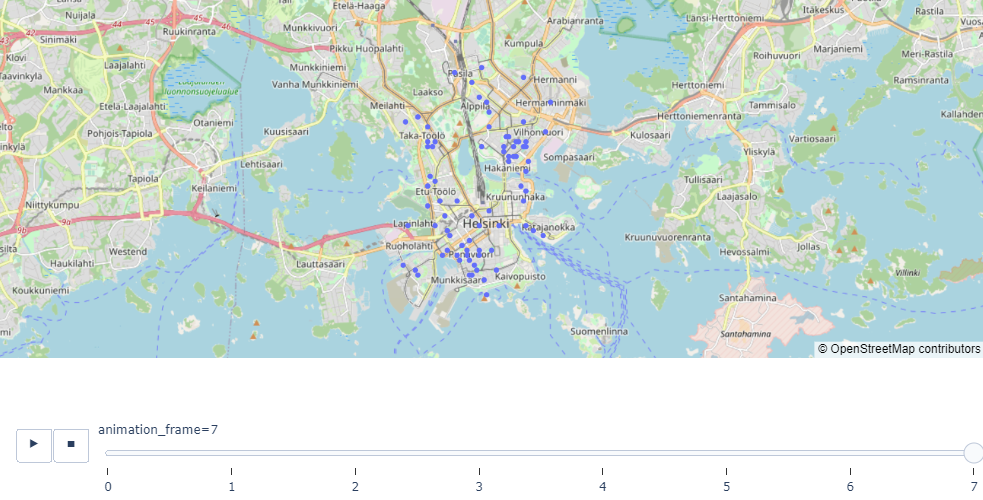
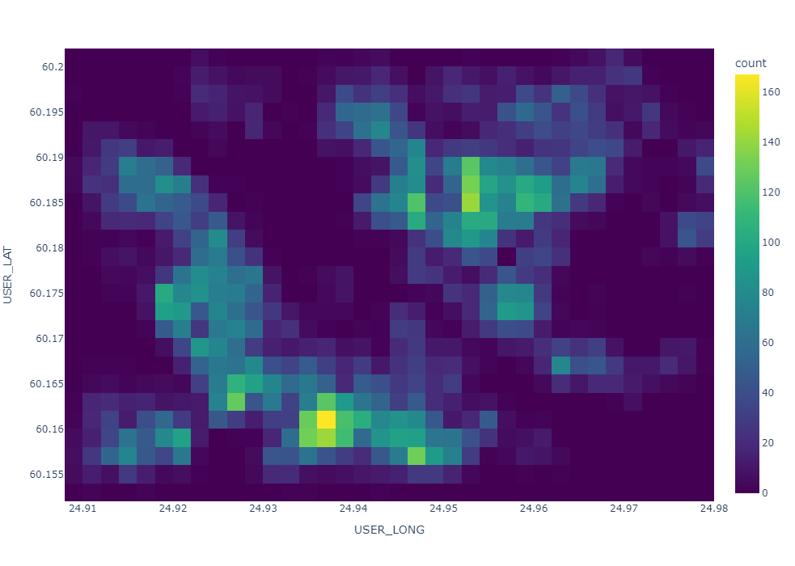
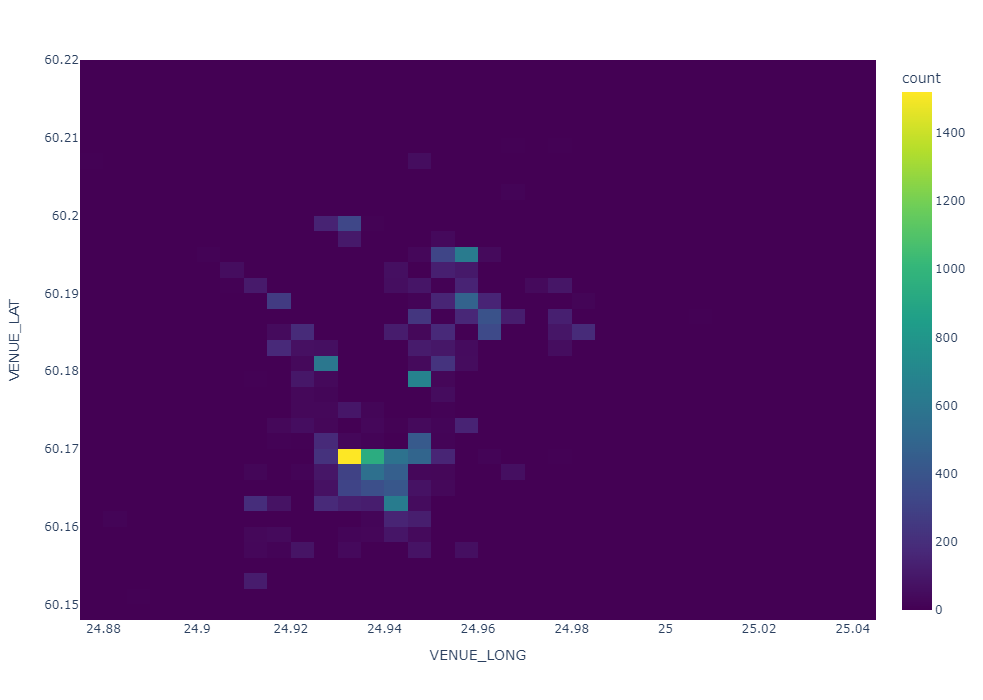
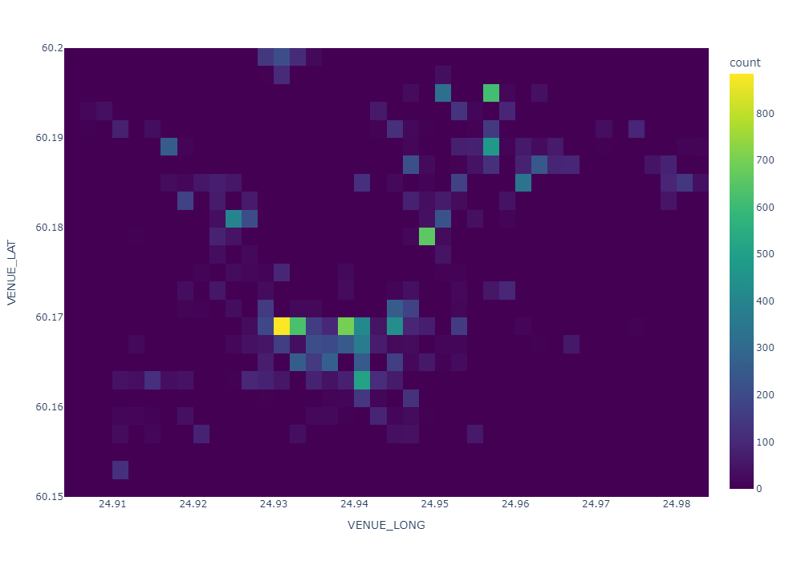
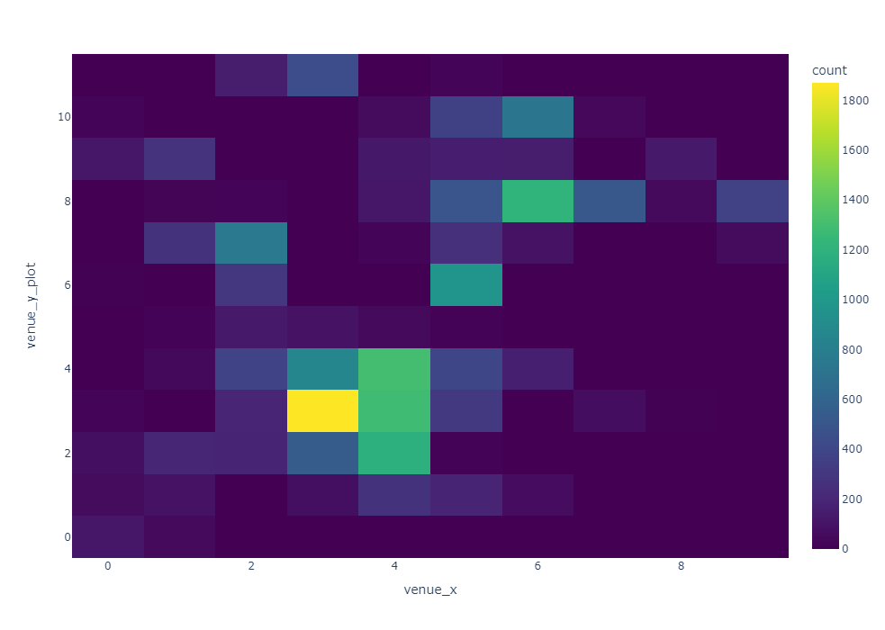
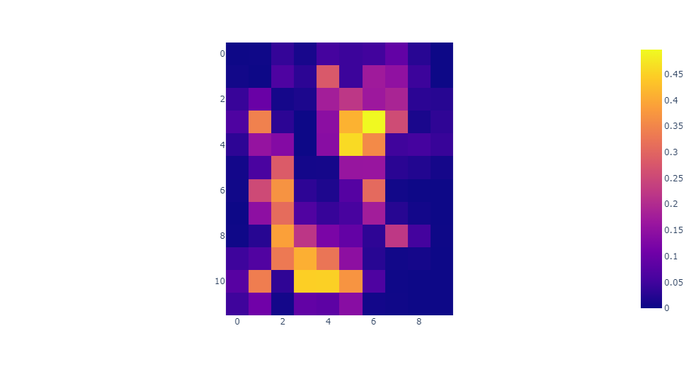
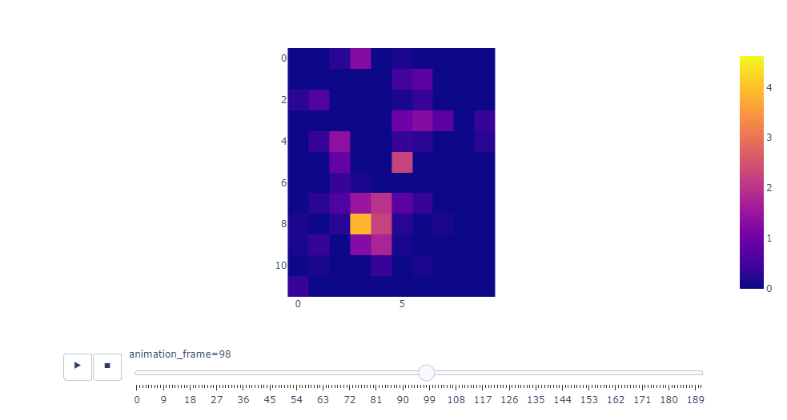

# Rudakov Evgenii - Data Science Summer Intern assignment 2022

## Time-spatial orders forecasting for next hour

## Plan

1. [Introduction](#introduction)
2. [Idea and motivation](#idea-and-motivation)
3. [Exploration](#exploration)
4. [Data processing](#data-processing)
5. [Baselines](#baselines)
6. [Models](#models)
7. [Evaluation](#evaluation)
8. [Further development](#further-development)
9. [Background](#background)

## introduction

After taking a look at the data, I decided to take quite challenging task. Time-spatial predicting of orders number in given area at a given time. The task hardly can be accomplished on good enough level given the amount of time and data, especially by the fact data look quite synthetic. But it can be an interesting point of view on the data we have. So, I wasn't trying to create a high-performance solution, but I tried to integrate some interesting approaches into the solution and see if they can work well.

## Idea and motivation

By having spatial-temporal orders prediction, we can make something similar to famous taxi surge pricing systems.
Relying on this information, we will be able to:
*	Inform our couriers which area are more preferable for them to go if they want to get next order quickly
*	Recommend users venues according also the demand level
*	Balancing supply and demand by changing delivery fee
*	Use this information as an additive input to the order time prediction model

It worth noting that for using the model for these purposes, it’s also good to have some additive information, at least number of couriers and their locations.

## Exploration

There are not clear interesting correlations in the data, only between weather conditions and actual/estimated time. Therefore, we can skip the linear models.

Also we can see high seasonality effect on the number of orders

## Data processing

* Removing outliers
* Time features extracting
* Changing coordinate system and down sampling
* Aggregating orders to time-spatial bins
* Aggregating local and global features
* Splitting to train and test

By moving to new coordinate system, we can do an assumption that the earth is flat because Helsinki is small city enough not to take care about curvature.

New data representation is 3D - \[Timestamps, Y, X]. Data are aggregated with window length of 1 hour and 15 minutes window step. For each timestamp we have a density map with the sum of orders made from given location.

## Baselines

* **Spatial average map**
* **Time-spatial average map**

The first baseline is chosen to simply have some sort of start. But the second baseline seems to me promising for the problem, it is unlikely that such a solution can be in the product, but it is interesting that we can have some predictions distributed in space without even having a model. And perhaps, given the amount of data, this solution will not be so easy to beat.

## Models

* **TinyNN**
* **DeeperNN**
* **LSTM**

The first model was used simply as a sanity check. In the second model, I tried to integrate knowledge about the orders distribution from baseline 2 as input, as well as global information about the weather, the average order time etc. In order to extract some useful information from such a heterogeneous set of features, I increased the depth of the model. Also, I made LSTM model which supposed to do time-series well.

## Evaluation
Fully connected neural and LSTM networks didn't do the job well, it was pretty obvious given the amount of data and the fact that data orders are mostly related to the time. But I can say that initial baselines were quite good and simple solution and they perform similar to the deep learning models. Performance increasing was obtained by Deeper model by the fact it exploits Time-Spatial Average map for current timestamp as input and it also takes global features for previous timestamp which allows model to improve static map results.

If I continue working with this data, I would prefer to improve time-spatial average map by making it dynamic and incorporating the trend. If I have more data for this task I would take a look at more sophisticated deep learning models and ways of feature extraction and data representation.

| Method               | RMSE   | MAE    | MAPE(without taking  zeros into account) | Corr Coef |
|----------------------|--------|--------|----------------------------------------------|-----------|
| Spatial Average      | 0.4819 | 0.1899 | 0.8419                                       | 0.1724    |
| Time-spatial average | 0.3702 | 0.1193 | 0.6297                                       | 0.6501    |
| TinyNN               | 0.3705 | 0.1265 | 0.6283                                       | 0.6466    |
| DeeperNN             | 0.3538 | 0.1105 | 0.6141                                       | 0.6867    |
| LSTM                 | 0.3655 | 0.1194 | 0.6237                                       | 0.6508    |

## Further development
*	I will not even say about need of more data
*	Integrate levels of abstraction for our task, forecast for the whole city, and smaller parts in descending order. It can be done by U-net with appropriate loss functions after each decoding level
*	Take a look on hexagons spatial representation which is more robust to location and zoom level changes
*	More features can be extracted from the data: e. g. cyclical time encoding, playing with weather to have somehow ‘whether feels like’ features
*	Graph Neural Networks which allow to better take into account spatial connectivity
*	Actually, not only graphs models, initially I planned to play at least with CNNs but didn’t have time for it. Also, I didn’t apply time-series models like ARIMA for the data
*	Use more open data as a model input:
     *	More weather data, including currently available precipitation map services and future forecasting
     *	Traffic data
     *	Spatial application usage date at current time
     *	Incorporating information about holidays, lockdowns, big events
     *	And so on 

## Background

You can take a look on my background in my CV and Cover Letter.